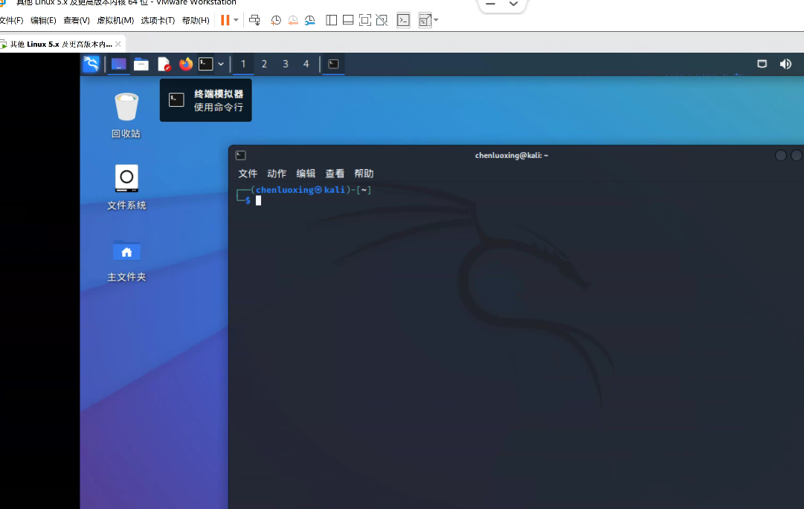
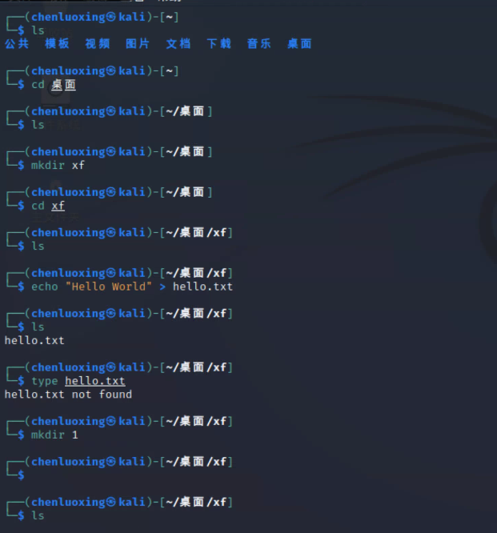
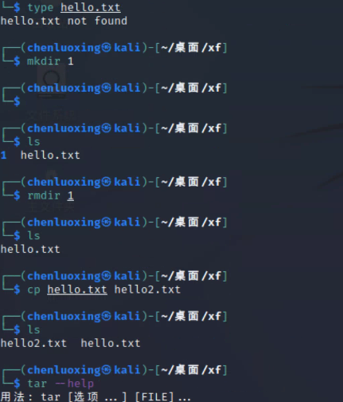
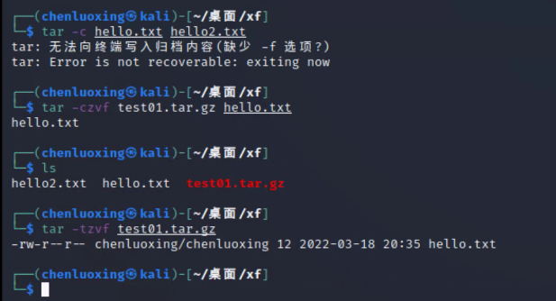
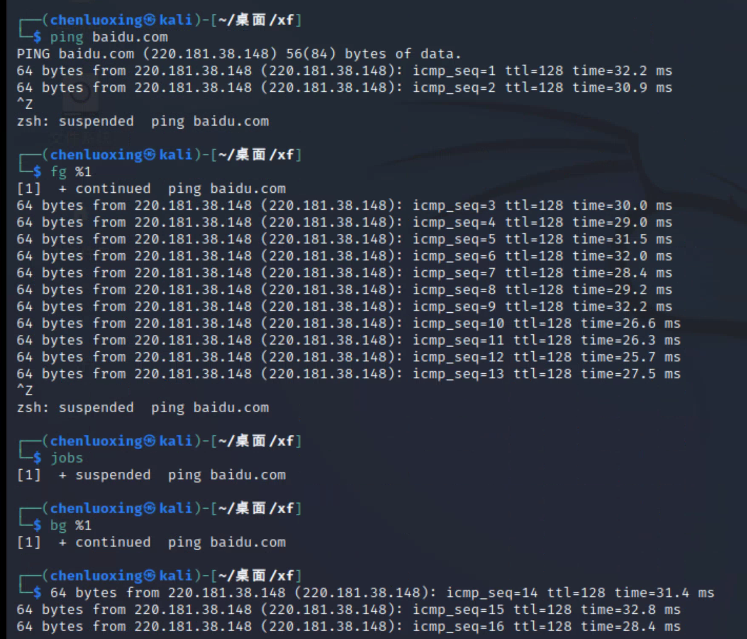
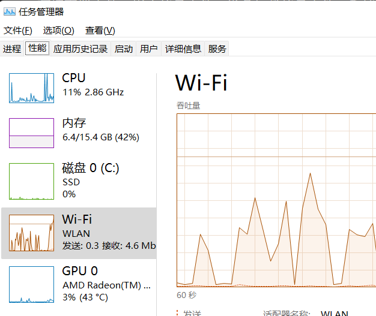
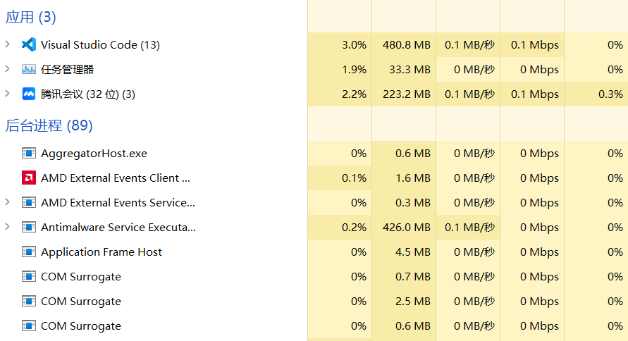
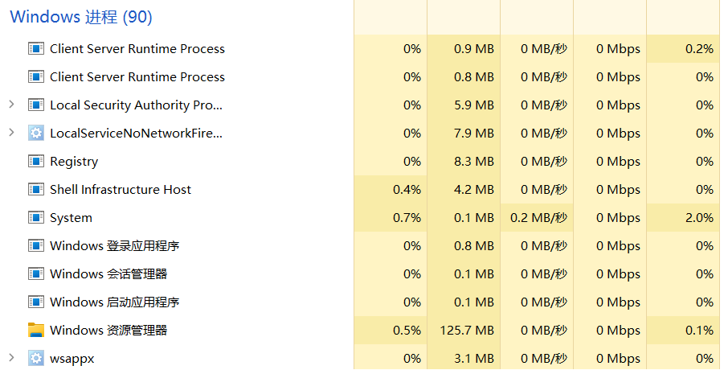
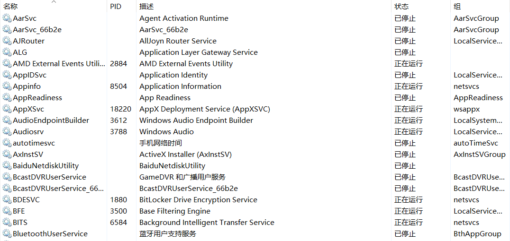

# 《操作系统课程设计》实验一：安装Linux系统并学会简单使用Linux和Windows命令

> 学生姓名：庞晓宇&nbsp;&nbsp;&nbsp;&nbsp;年级专业：软件工程&nbsp;&nbsp;&nbsp;&nbsp;学号：2020118100

## 一、实验目的
1. 通过Linux系统理解操作系统原理；
2. 熟悉Linux系统安装过程和相关参数配置；
3. 熟悉Linux和Windows系统常用命令的使用。

> 要求
> 1. 必须自己独立完成，若发现抄袭（从网上或其他同学）或雷同则取消本课程考试资格！
> 2. 撰写并提交实验报告。
> 3. 提供Linux系统和Windows系统使用时的界面截图及简单说明。


## 二、实验内容
1. 在自己的机器（虚拟机）上成功安装Linux系统；
   - 参考：[XF_VMware16](./XF_VMware16虚拟机安装.md)
   1. 安装过程无截图
   2. 进入桌面：
2. 能熟悉使用Linux系统常用命令：
    > ls, cd, md, rd, rm, cp, tar, 注意所关联的参数  
    > 程序前台和后台执行；挂载设备命令  
    > 查看Linux环境配置文件、用户信息文件、设备加载信息文件，系统启动脚本文件
   1. ls, cd, md, rd, rm, cp, tar, 注意所关联的参数
      - 
      - 
      - 
   2. 程序前台和后台执行；挂载设备命令
      - 
   3. 查看Linux环境配置文件、用户信息文件、设备加载信息文件，系统启动脚本文件
      - 
3. 通过Windows系统的任务管理器，了解Windows系统中的进程（用户进程与系统进程）和服务；
   - 任务管理器
     - 
   - 用户进程
     - 
   - 系统进程
     - 
   - 服务
     - 
4. 通过Windows系统的控制台终端（cmd命令）熟悉系统常用命令：copy del dir cd，比较与Linux命令的使用不同之处
   1. 相关命令的使用
    ```cmd
    PS C:\Users\25810\Desktop\Workspace\操作系统实验一> dir


        目录: C:\Users\25810\Desktop\Workspace\操作系统实验一


    Mode                 LastWriteTime         Length Name
    ----                 -------------         ------ ----
    d-----         2022/3/18     19:09                imgs
    -a----         2022/3/18     18:26            422 XF_VMware16虚拟机安装激活.md
    -a----         2022/3/18     17:49          17019 《操作系统课程设计》实验一.docx
    -a----         2022/3/18     19:09           1467 操作系统实验一.md


    PS C:\Users\25810\Desktop\Workspace\操作系统实验一>
    PS C:\Users\25810\Desktop\Workspace\操作系统实验一> cd .\imgs\
    PS C:\Users\25810\Desktop\Workspace\操作系统实验一\imgs> dir


        目录: C:\Users\25810\Desktop\Workspace\操作系统实验一\imgs


    Mode                 LastWriteTime         Length Name
    ----                 -------------         ------ ----
    -a----         2022/3/18     18:19          88055 2022-03-18-18-19-57.png
    -a----         2022/3/18     18:20         176390 2022-03-18-18-20-13.png
    -a----         2022/3/18     18:20          34757 2022-03-18-18-20-40.png
    -a----         2022/3/18     18:21          80375 2022-03-18-18-21-53.png
    -a----         2022/3/18     19:07          46200 2022-03-18-19-07-05.png
    -a----         2022/3/18     19:07          48914 2022-03-18-19-07-27.png
    -a----         2022/3/18     19:09          65060 2022-03-18-19-09-20.png
    -a----         2022/3/18     19:09          36871 2022-03-18-19-09-51.png


    PS C:\Users\25810\Desktop\Workspace\操作系统实验一\imgs> copy .\2022-03-18-18-19-57.png test.png
    PS C:\Users\25810\Desktop\Workspace\操作系统实验一\imgs> dir


        目录: C:\Users\25810\Desktop\Workspace\操作系统实验一\imgs


    Mode                 LastWriteTime         Length Name
    ----                 -------------         ------ ----
    -a----         2022/3/18     18:19          88055 2022-03-18-18-19-57.png
    -a----         2022/3/18     18:20         176390 2022-03-18-18-20-13.png
    -a----         2022/3/18     18:20          34757 2022-03-18-18-20-40.png
    -a----         2022/3/18     18:21          80375 2022-03-18-18-21-53.png
    -a----         2022/3/18     19:07          46200 2022-03-18-19-07-05.png
    -a----         2022/3/18     19:07          48914 2022-03-18-19-07-27.png
    -a----         2022/3/18     19:09          65060 2022-03-18-19-09-20.png
    -a----         2022/3/18     19:09          36871 2022-03-18-19-09-51.png
    -a----         2022/3/18     18:19          88055 test.png


    PS C:\Users\25810\Desktop\Workspace\操作系统实验一\imgs> del .\test.png
    PS C:\Users\25810\Desktop\Workspace\操作系统实验一\imgs> dir


        目录: C:\Users\25810\Desktop\Workspace\操作系统实验一\imgs


    Mode                 LastWriteTime         Length Name
    ----                 -------------         ------ ----
    -a----         2022/3/18     18:19          88055 2022-03-18-18-19-57.png
    -a----         2022/3/18     18:20         176390 2022-03-18-18-20-13.png
    -a----         2022/3/18     18:20          34757 2022-03-18-18-20-40.png
    -a----         2022/3/18     18:21          80375 2022-03-18-18-21-53.png
    -a----         2022/3/18     19:07          46200 2022-03-18-19-07-05.png
    -a----         2022/3/18     19:07          48914 2022-03-18-19-07-27.png
    -a----         2022/3/18     19:09          65060 2022-03-18-19-09-20.png
    -a----         2022/3/18     19:09          36871 2022-03-18-19-09-51.png
    ```
   2. 比较与Linux命令的使用不同之处
      1. cmd命令的起源：DOS
         1. DOS（Disk Operating System，磁盘操作系统），是Windows系统之前的一个操作系统名称，属于单用户单任务式的，特点通常是黑底白字，用户全靠键盘输入命令来完成所有工作。之后Windows诞生了，属于多用户多任务式的（系统名称都是多窗口），初期当然还得使DOS系统可用，再之后专门开辟个cmd窗口来模仿DOS界面及大多数的命令，也称为命令行，这就是cmd命令行的诞生。
         2. Windows里面运行cmd出来的DOS不是真正的DOS，那是微软在windows里虚拟的DOS环境，是用来运行一些高级命令的，真正的DOS是脱离系统的。因为他本身就是一种操作系统。因此，可以得出一个结论就是：cmd是一个实现了DOS功能的接口，可以使用DOS的部分功能，支持DOS的部分指令。
      2. cmd命令和linux命令的区别
         1. 最根本的区别是linux shell是linux操作系统的一个用户交互层；而cmd只是windows系统下的一个小小的应用。
         2. shell是介于应用程序和内核之间的壳，所有应用程序要和内核交互都必须要通过shell，包括linux的图形桌面Xwindow；而cmd只是windwows下一个补充，cmd是否存在对windows系统并没有那么重要。
         3. linux在没有图形界面下几乎可以完成任何事情，而且比图形桌面更简洁高效，还可以配合shell编程实现自动化；而cmd只是windows下的一个终端模拟器，相当于一个桌面应用，不能单独存在。、
         4. shell功能强大，体验极佳；cmd蹩脚难用，功能有限。其实windows一直改善cmd，但是总是不够强大，最后还是妥协引入shell，比如win7的powershell和win10的linux shell，尽管还是没有专业的shell强大。这个一定程度上说明了shell远比cmd要强大得多。
      3. 一些具体命令的不同
            | 功能               | cmd    | linux         |
            | ------------------ | ------ | ------------- |
            | 复制文件           | copy   | cp            |
            | 移动文件           | move   | mv            |
            | 列举文件           | dir    | ls            |
            | 清除屏幕           | cls    | clear         |
            | 退出               | exit   | exit          |
            | 显示修改日期       | date   | date          |
            | 删除文件           | del    | rm            |
            | 回响信息到屏幕     | echo   | echo          |
            | 用编辑器编辑文件   | edit   | vi            |
            | 比较文件内容       | fc     | diff          |
            | 在文件中查找字符串 | find   | grep          |
            | 显示命令帮助       | 命令/? | man&nbsp;命令 |
            | 创建目录           | mkdir  | mkdir         |
            | 删除目录           | rd     | rmdir         |
            | 目录更名           | move   | mv            |
            | 拷贝目录           | xcopy  | copy          |
            | 查看文件           | more   | less          |
            | 重命名文件         | ren    | mv            |
            | 切换目录           | cd     | cd            |
            | 显示时间           | time   | date          |
            | 显示已被使用的内存 | mem    | free          |
            | 在屏幕打印文件内容 | type   | cat           |
5. 内核编译 系统配置 shell程序开发 gcc编译器使用 进程状态信息查看 控制管理
   1. Linux内核编译
      1. 下载内核源码，可以到kernel.org上进行下载。
      2. 解压内核源文件（注意：要先使用cd命令进入压缩包所在目录），可以使用如下命令：
         `tar -xvf  压缩包名称`
      3. 配置内核(进入到该图形界面后，进行内核配置。配置时，大部分都是使用其默认选项，小部分才根据需要进行选择。)
         1. 其中，每一个配置选项有三种选择，它们的含义如下：
            1. <*>或[*]：表示将该功能编译进内核
            2. [ ]：表示不将该功能编译进内核
            3. [M]：表示将该功能编译成在需要时动态插入到内核的代码
            4. 用户根据需要进行配置。
            5. 注意：
               1. 如果在这一步中，输入make menuconfig命令时出现了下面的错误：说明你没有进入内核解压后的文件夹中。
               2. 如果在这一步中，输入make menuconfig命令时缺少相应的文件，可以使用如下命令进行解决：
                  `apt-get install libncurses5-dev libncursesw5-dev`
      4. 使用如下命令，进行编译：
         1. sudo make -j4
         2. sudo make modules_install
         3. sudo make install 
         4. reboot


