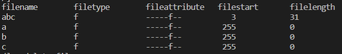
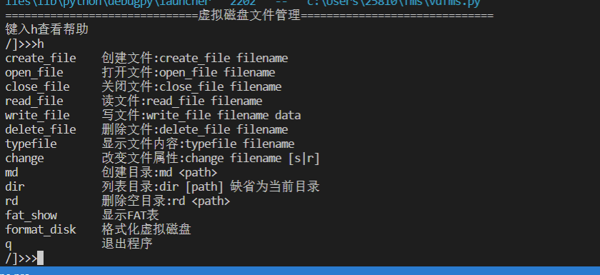
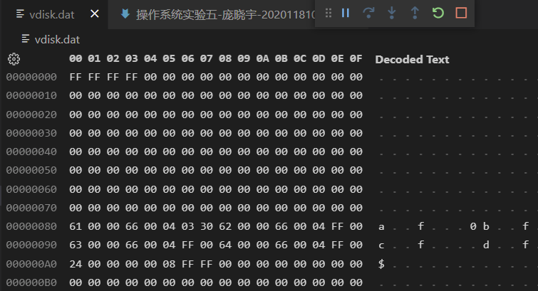
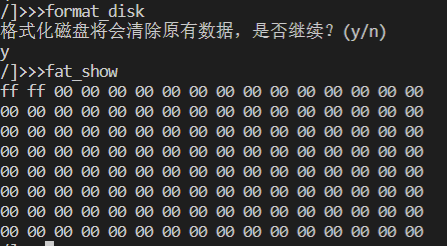
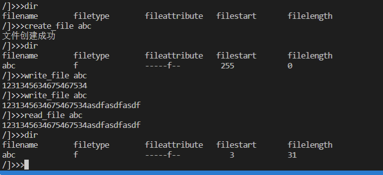
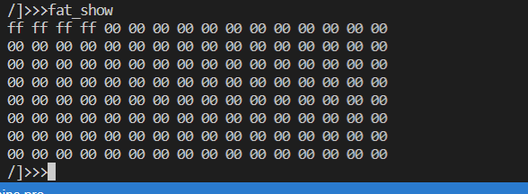
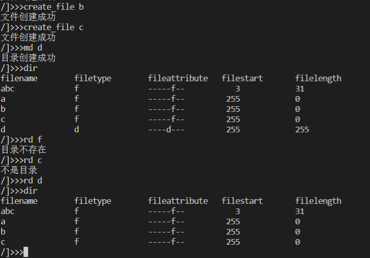
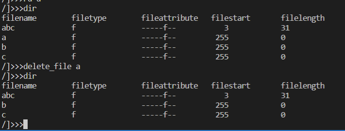
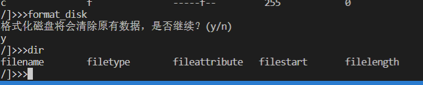

# 实验五 -- 一个小型磁盘文件管理系统

> - 姓名：庞晓宇
> - 学号：2020118100


## 目的
1. 理解磁盘文件管理的概念和原理。
2. 了解文件的逻辑结构和物理结构；
3. 理解文件目录结构；
4. 掌握磁盘存储空间管理、文件操作实现方法。


## 内容
设计并实现一个简单的磁盘文件管理系统，用文件模拟磁盘，用数组模拟缓冲区，要求实现：
1. 支持多级目录结构，支持文件的绝对路径访问；
2. 文件的逻辑结构采用流式（字节流）结构，物理结构采用链式结构中的显式链方式；
3. 磁盘管理采用文件分配表；
4. 实现文件操作命令：创建目录、列表目录、删除空目录、创建文件、删除文件、显示文件内容、打开文件、读文件、写文件（追加方式）、关闭文件、改变文件属性；
5. 通过主函数对所实现的功能进行测试。

扩展
- 支持相对路径；支持文件COPY、移动和非空目录删除。

设计
1. 文件的组织结构
   - 文件的逻辑结构有流式和记录式两种形式，本项目只支持流式文件。
   - 显式链接的物理结构是把组成一个文件的每一块的指针组织在一起，形成一个文件分配表（FAT）。
2. 磁盘空间管理
   - 本项目用一个文件模拟一个小磁盘：128个盘块、每块64字节，块号0，1，2，3，。。。，127。
3. 文件分配表（FAT）
   - 磁盘有多少块，文件分配表就有多少项，磁盘块号与FAT表项序号一一对应。
   - 每项取值：若某文件的一个磁盘块号为i，则该文件的下一个磁盘块号应该存放在FAT的第i项，-1（255）表示文件结束；为0表示这是一个空闲块；可以用一个非0、非-1、非有效块号的值（如254）表示一个故障盘块。
   - 分配时查找值为0的项（设置一个“空闲块总数”变量可以提高分配下率!），并建立链表；回收时只需修改要回收的盘块对应表项的值。
   - 假定系统区（引导区、文件分配表、根目录等）占用的磁盘起始的若干盘块（比如3块，如下0、1、2块）。
        | 第几项 | 0   | 1   | 2   | 3   | 4   | 5   | 6   | 7   | 8   | 9   | 10  | 11  | 12  | 13  | 14  | 15  | 16  | ... |
        | ------ | --- | --- | --- | --- | --- | --- | --- | --- | --- | --- | --- | --- | --- | --- | --- | --- | --- | --- |
        | 值     | -1  | -1  | -1  | 4   | 9   | 0   | 7   | 8   | -1  | 12  | 11  | -1  | 13  | -1  | 0   | 0   | 254 | ... |
    （如上，3个文件分别放在(3->4->9->12->13)、(6->7->8)和(10->11)中，5、14、15…是空闲块，块16故障）
    ```
      ff ff 00 00 00 00 00 00 00 00 00 00 00 00 00 00 
      00 00 00 00 00 00 00 00 00 00 00 00 00 00 00 00
      00 00 00 00 00 00 00 00 00 00 00 00 00 00 00 00
      00 00 00 00 00 00 00 00 00 00 00 00 00 00 00 00
      00 00 00 00 00 00 00 00 00 00 00 00 00 00 00 00
      00 00 00 00 00 00 00 00 00 00 00 00 00 00 00 00
      00 00 00 00 00 00 00 00 00 00 00 00 00 00 00 00
      00 00 00 00 00 00 00 00 00 00 00 00 00 00 00 00
    ```
4. 目录结构
   - 文件目录用于文件检索。
   - 目录项：文件目录由若干目录项组成，每一项有8字节大小，记录一个文件的有关信息，包括：文件名（3字节）、文件类型（2字节）、文件属性（1字节）、起始盘块号（1字节）、文件长度（1字节，盘块数）。
   - 目录结构：树型目录。目录也以文件形式存放在磁盘。根目录存放在磁盘1号块，子目录所在盘块号登记在根目录相应目录项中。本项目中，目录（根和子）的长度固定—8个目录项。一个目录项究竟对应的 是一个文件还是一个子目录，由“文件属性”指明。
    
    文件属性（1字节）：
    | 第7位  | 第6位  | 第5位  | 第4位  | 第3位    | 第2位    | 第1位    | 第0位    |
    | ------ | ------ | ------ | ------ | -------- | -------- | -------- | -------- |
    | 未使用 | 未使用 | 未使用 | 未使用 | 目录文件 | 普通文件 | 系统文件 | 只读文件 |
   ```python
   def get_attributes_string(fileattribute):
    s = '----'
    s += 'd' if fileattribute & ATTRIBUTE_DIR else '-'
    s += 'f' if fileattribute & ATTRIBUTE_FILE else '-'
    s += 's' if fileattribute & ATTRIBUTE_SYS else '-'
    s += 'r' if fileattribute & ATTRIBUTE_READONLY else '-'
    return s
   ```
5. 文件命名
   - 文件名3字节，仅可以使用字母、数字和除“$”、“.”、“/”以外的字符，第一字节的值为“$”时表示该目录为空目录，文件名与类型之间用“.”分隔，用“/”作为路径中目录间分隔符。

    文件检索（根据绝对路径名）
   - 读出根目录盘块用路径名中根目录后的目录名检索根目录中的目录项，检索完一块，再根据FAT找到下一块，再读入检索直到检索到名字一致的目录项或根目录项已查完若未找到，则检索失败，结束；若找到的是文件，结束；若找到的是目录，则从找到的目录项中取出目录的起始盘块号，读入此盘块，使用以上检索方法继续查找，直到找到该文件（或目录）或检索失败。
6. 文件操作
   - 创建文件（create_file）、打开文件(open_file)、关闭文件(close_file)、读文件(read_file)、写文件（write_file）、删除文件(delete_file)、显示文件内容(typefile) 、改变文件属性(change)、创建目录(md)、列表目录(dir)、删除空目录(rd) –用选择方式输入命令；
   ```python
   operator_dict = {'create_file': create_file, 'open_file': open_file, 'close_file': close_file,
                 'read_file': read_file, 'write_file': write_file, 'delete_file': delete_file,
                 'typefile': typefile, 'change': change, 'md': md, 'dir': dir, 'rd': rd,
                 'fat_show': fat_show, 'format_disk': format_disk, 'q': q}
   ```
   - 用“已打开文件表”记录已打开或建立文件的相关信息：
        路径名|文件属性|起始块号|文件长度|操作类型|读指针（块号|偏移量）|写指针（块号|偏移量）


## 测试输出

- 建立一个文件，模拟磁盘；
   
- 初始化磁盘FAT和根目录初始为空目录项；
   
- 选择文件操作命令，输入有关参数，进行测试——输出相应数据结构内容。
   
   
   
   
   


## 源文件
```python
import math
import os
import traceback

FILE_NAME = "vdisk.dat"
vdisk = ...  # 虚拟磁盘文件

DISK_BLOCK = 128  # 块数
BLOCK_SIZE = 64  # 块大小
DISK_SIZE = DISK_BLOCK * BLOCK_SIZE
FAT_SIZE = math.ceil(DISK_BLOCK / BLOCK_SIZE)  # FAT表占用块数，也是根目录的FAT下标

FREE_FLAG = 0  # 空闲标志
END_FLAG = 255  # 结束标志
NOT_FOUND_FLAG = 254  # 没有该文件或目录

# EOF = bytes('#', 'ascii')[0]  # 文件尾空标志
# IDLE_ENTRY = bytes('$', 'ascii')[0]  # 目录项空标志
EOF = '#'
IDLE_ENTRY = '$'

FAT = []  # FAT表
dir_stack = []  # 目录栈 每一项是[目录项, 块号]
current_dir_files = []  # 当前目录文件列表 每一项是一个文件或目录的相关信息[文件名，文件类型，文件属性，文件起始块，文件长度]
open_files = []  # 所有打开文件的目录栈 每一项是一个[[目录项, 块号], ...]


ATTRIBUTE_DIR = 0b00001000
ATTRIBUTE_FILE = 0b00000100
ATTRIBUTE_SYS = 0b00000010
ATTRIBUTE_READONLY = 0b00000001


# 创建虚拟磁盘
def vdisk_create():
    f = open(FILE_NAME, 'wb+')
    diskdata = [0 for i in range(DISK_SIZE)]
    for i in range(FAT_SIZE):
        diskdata[i] = END_FLAG
    f.write(bytes(diskdata))
    f.close()


# 读取FAT表
def fat_read():
    global vdisk, FAT
    vdisk.seek(0)
    fat = vdisk.read(FAT_SIZE * BLOCK_SIZE)
    FAT = [i for i in fat]


# 显示FAT表
def fat_show(*args):
    '''显示FAT表'''
    global FAT
    for i, c in enumerate(FAT):
        # 一行显示16个字节
        if i % 16 == 0 and i != 0:
            print()
        print('{:02x}'.format(c), end=' ')
    print()


# 写入FAT表
def fat_write():
    global vdisk, FAT
    vdisk.seek(0)
    vdisk.write(bytes(FAT))


# 剩余空闲块数量
def vdisk_freeblocks():
    global FAT
    return FAT.count(FREE_FLAG)


# 关闭虚拟磁盘
def vdisk_close():
    global vdisk
    fat_write()
    vdisk.close()


# 读取一个块
def vdisk_readblock(block_num):
    global vdisk
    vdisk.seek(block_num * BLOCK_SIZE)
    data = vdisk.read(BLOCK_SIZE)
    return data


# 写入一个块
def vdisk_writeblock(block_num, data):
    global vdisk
    vdisk.seek(block_num * BLOCK_SIZE)
    vdisk.write(data)


# 得到下一个块的块号，参数是当前块号，返回下一个块号，如果没有下一个块，返回END_FLAG
def vdisk_nextblock(block_num):
    global FAT
    v = FAT[block_num]
    if FAT_SIZE < v < DISK_BLOCK:
        return v
    return END_FLAG


# 得到块号列表
# in vdisk_nextblock
#     v = FAT[block_num]
# TypeError: list indices must be integers or slices, not NoneType
def vdisk_getblocklist(block_num):
    block_numlist = []
    while block_num != END_FLAG:
        block_numlist.append(block_num)
        block_num = vdisk_nextblock(block_num)
    return block_numlist


# 读取一系列块
def vdisk_readblocks(block_num):
    block_numlist = vdisk_getblocklist(block_num)
    data = b''
    for i in block_numlist:
        data += vdisk_readblock(i)
    return data


# 写入一系列块
# bug:in vdisk_writeblocks 已修复
#     for i in range(block_numlist):
# TypeError: 'list' object cannot be interpreted as an integer
def vdisk_writeblocks(block_numlist, data):
    if len(data) // BLOCK_SIZE > len(block_numlist):
        data = data[:len(block_numlist) * BLOCK_SIZE]
    # for i in range(len(data) // BLOCK_SIZE):
    #     vdisk_writeblock(
    #         block_numlist[i], data[i * BLOCK_SIZE: (i + 1) * BLOCK_SIZE])
    # if len(data) % BLOCK_SIZE != 0:
    #     vdisk_writeblock(block_numlist[-1], data[i * BLOCK_SIZE:])
    for i in range(len(block_numlist)):
        vdisk_writeblock(
            block_numlist[i], data[i * BLOCK_SIZE: (i + 1) * BLOCK_SIZE])


# 解码目录项
def get_fileinfo(item):
    filename = item[0:3].decode('ascii')
    for i in range(3):
        if item[i] == 0:
            filename = item[0:i].decode('ascii')
            break
    if len(filename) == 0 or filename == IDLE_ENTRY:
        return []
    filetype = item[3:5].decode('ascii')
    for i in range(3, 5):
        if item[i] == 0:
            filetype = item[3:i].decode('ascii')
            break
    fileattribute = item[5:6][0]
    filestart = item[6:7][0]
    filelength = item[7:8][0]
    return [filename, filetype, fileattribute, filestart, filelength]


# 编码目录项
def set_fileinfo(filename, filetype, fileattribute, filestart, filelength):
    fileinfo = []
    for i in range(3):
        if i < len(filename):
            fileinfo.append(ord(filename[i]))
        else:
            fileinfo.append(0)
    for i in range(2):
        if i < len(filetype):
            fileinfo.append(ord(filetype[i]))
        else:
            fileinfo.append(0)
    fileinfo.append(fileattribute)
    fileinfo.append(filestart)
    fileinfo.append(filelength)
    return bytes(fileinfo)


# 读取目录项，参数是目录项起始块号
def vdisk_listread(block_num):
    blocks = vdisk_readblocks(block_num)
    dir_files = []
    for i in range(len(blocks)//8):
        fileinfo = get_fileinfo(blocks[i*8:i*8+8])
        if len(fileinfo) > 0:
            dir_files.append(fileinfo)
        else:
            break
    return dir_files


# 申请n个块的空间，返回空闲块号列表
# bug:in vdisk_alloc 已修复
#     FAT[start] = END_FLAG
# IndexError: list assignment index out of range
def vdisk_alloc(n, start=END_FLAG):
    # if n <= 0:
    #     return []
    global FAT
    block_numlist = []
    if start != END_FLAG:
        block_numlist.append(start)
        FAT[start] = END_FLAG
        n -= 1
        if n == 0:
            return block_numlist
    for i, c in enumerate(FAT):
        if c == FREE_FLAG:
            block_numlist.append(i)
            n -= 1
            if n == 0:
                break
    if n > 0:
        return []
    for i in range(len(block_numlist) - 1):
        FAT[block_numlist[i]] = block_numlist[i + 1]
    FAT[block_numlist[-1]] = END_FLAG
    return block_numlist


# 释放空间，参数是空闲块号列表或第一个空闲块号
def vdisk_free(block_num):
    global FAT
    if isinstance(block_num, int):
        block_num = vdisk_getblocklist(block_num)
    for i in range(len(block_num)):
        FAT[block_num[i]] = FREE_FLAG


# 写入目录项，参数是目录项起始块号，参数是目录项列表
def vdisk_listwrite(block_num, dir_files):
    vdisk_free(block_num)
    block_numlist = vdisk_alloc(math.ceil(len(dir_files)/8), block_num)
    lists = b''
    for i in range(len(dir_files)):
        lists += set_fileinfo(*dir_files[i])
    if len(dir_files) % 8 != 0:
        lists += set_fileinfo(IDLE_ENTRY, '',
                              ATTRIBUTE_DIR, END_FLAG, END_FLAG)
    vdisk_writeblocks(block_numlist, lists)


# 虚拟磁盘初始化、加载
# 手动格式化无效
def vdisk_init(flag):
    global vdisk, dir_stack, current_dir_files
    if flag or not os.path.exists(FILE_NAME) or os.path.getsize(FILE_NAME) == 0:
        vdisk_create()
    vdisk = open(FILE_NAME, 'rb+')
    fat_read()
    dir_stack = [['', FAT_SIZE]]
    current_dir_files = vdisk_listread(FAT_SIZE)


# 格式化虚拟磁盘
def format_disk(*args):
    '''格式化虚拟磁盘'''
    global vdisk
    print("格式化磁盘将会清除原有数据，是否继续？(y/n)")
    if input().upper() != 'Y':
        print("格式化已取消")
        return
    vdisk.close()
    vdisk_init(True)


# bug:in vdisk_gwd 已修复
#     return '/'.join(ds)
# TypeError: sequence item 0: expected str instance, list found
def vdisk_gwd(*args):
    global dir_stack
    ds = args[0] if len(args) > 0 else [d[0] for d in dir_stack]
    if len(ds) > 1:
        return '/'.join(ds)
    return '/'


def get_attributes_string(fileattribute):
    s = '----'
    s += 'd' if fileattribute & ATTRIBUTE_DIR else '-'
    s += 'f' if fileattribute & ATTRIBUTE_FILE else '-'
    s += 's' if fileattribute & ATTRIBUTE_SYS else '-'
    s += 'r' if fileattribute & ATTRIBUTE_READONLY else '-'
    return s


def show_diritems(dir_files):
    print('filename\tfiletype\tfileattribute\tfilestart\tfilelength')
    for filename, filetype, fileattribute, filestart, filelength in dir_files:
        print('{:4s}\t\t{:3s}\t\t{:9s}\t{:4d}\t\t{:d}'.format(
            filename, filetype, get_attributes_string(fileattribute), filestart, filelength))


# 路径解析，返回该目录的绝对路径栈
# bug:创建文件后当前路径改变 已修复
# /]>>>md a
# 目录创建成功
# /a]>>>
def path_decode(spath):
    global dir_stack, current_dir_files
    mypath = []
    temp_dir_files = []
    if not spath.startswith('/'):
        mypath = dir_stack[:]
        temp_dir_files = current_dir_files[:]
    for p in spath.split('/'):
        if p == '..':
            if len(mypath) > 1:
                mypath.pop()
        elif p != '':
            flag = False
            for filename, filetype, fileattribute, filestart, filelength in temp_dir_files:
                if filename == p:
                    mypath.append([p, filestart])
                    temp_dir_files = vdisk_listread(filestart)
                    flag = True
                    break
            if not flag:
                mypath.append([p, NOT_FOUND_FLAG])
        else:
            mypath = [['', FAT_SIZE]]
    # 单层路径超过三个字符，截取前三个字符
    for i in range(len(mypath)):
        if len(mypath[i][0]) > 3:
            mypath[i][0] = mypath[i][0][:3]
    return mypath


# 判断路径是否存在
def path_exist(path_stack):
    if len(path_stack) == 1:
        return True
    for p, b in path_stack:
        if b == NOT_FOUND_FLAG:
            return False
    return True


# 判断路径是否是目录，只有当前路径存在时有意义
def path_isdir(path_stack):
    if len(path_stack) <= 1:
        return True
    dir_files = vdisk_listread(path_stack[-2][1])
    for filename, filetype, fileattribute, filestart, filelength in dir_files:
        if filename == path_stack[-1][0]:
            if fileattribute & ATTRIBUTE_DIR != 0:
                return True
            else:
                return False
    return False


# /]>>>read_file a
# 不是文件
# /]>>>dir
# a       f       -----f--         255    0
def path_isfile(path_stack):
    if len(path_stack) <= 1:
        return False
    dir_files = vdisk_listread(path_stack[-2][1])
    for filename, filetype, fileattribute, filestart, filelength in dir_files:
        if filename == path_stack[-1][0]:
            if fileattribute & ATTRIBUTE_FILE != 0:
                return True
            else:
                return False
    return False


# 判断path1是否是path2的父路径
def is_father(path1, path2):
    if len(path1) > len(path2):
        return False
    for i in range(len(path1)):
        if path1[i][0] != path2[i][0]:
            return False
    return True


# 显示已经打开的文件
def show_open_files():
    global open_files
    for f in open_files:
        print(vdisk_gwd(f[0]))


# 递归创建目录
# bug:目录显示为文件 已修复
# /]>>>md a
# 目录创建成功
# /]>>>dir
# a       d       -----f--         255    255
def create_dir(path_stack):
    if len(path_stack) == 1:
        return path_stack[-1][1]
    if not path_exist(path_stack[:-1]):
        create_dir(path_stack[:-1])
    dir_files = vdisk_listread(path_stack[-2][1])
    for filename, filetype, fileattribute, filestart, filelength in dir_files:
        if filename == path_stack[-1][0]:
            print('目录已存在')
            return
    dir_files.append(
        [path_stack[-1][0], 'd', ATTRIBUTE_DIR, END_FLAG, END_FLAG])
    vdisk_listwrite(path_stack[-2][1], dir_files)
    print('目录创建成功')


# 创建文件（create_file）、打开文件(open_file)、关闭文件(close_file)、读文件(read_file)、
# 写文件（write_file）、删除文件(delete_file)、显示文件内容(typefile) 、改变文件属性(change)、
# 创建目录(md)、列表目录(dir)、删除空目录(rd)、查看FAT表(fat_show)、格式化虚拟磁盘(format_disk)
def create_file(*args):
    # global current_dir_files
    '''创建文件:create_file filename'''
    if len(args) != 1:
        print(create_file.__doc__)
        return
    path_stack = path_decode(args[0])
    if path_exist(path_stack):
        print("文件或路径已存在")
        return
    if not path_exist(path_stack[:-1]):
        b = create_dir(path_stack[:-1])
    else:
        b = path_stack[-2][1]
    # 创建文件
    dir_files = vdisk_listread(b)
    dir_files.append([path_stack[-1][0], 'f', ATTRIBUTE_FILE, END_FLAG, 0])
    vdisk_listwrite(b, dir_files)
    print('文件创建成功')


def open_file(*args):
    '''打开文件:open_file filename'''
    if len(args) != 1:
        print(open_file.__doc__)
        return
    path_stack = path_decode(args[0])
    if not path_exist(path_stack):
        print("文件不存在")
        return
    global open_files
    if path_isfile():
        open_files.append(path_stack)
        print("打开已打开")


def close_file(*args):
    '''关闭文件:close_file filename'''
    if len(args) != 1:
        print(close_file.__doc__)
        return
    path_stack = path_decode(args[0])
    global open_files
    for f in open_files:
        if is_father(f, path_stack):
            open_files.remove(f)
            print("文件已关闭")
            return
    print("文件未打开")


# bytes转换为str
def get_filecontent(context):
    s = ''
    for i in context:
        s += chr(i)
    return s


def read_file(*args):
    '''读文件:read_file filename'''
    if len(args) != 1:
        print(read_file.__doc__)
        return
    path_stack = path_decode(args[0])
    if not path_exist(path_stack):
        print("文件不存在")
        return
    if not path_isfile(path_stack):
        print("不是文件")
        return
    dir_files = vdisk_listread(path_stack[-2][1])
    for filename, filetype, fileattribute, filestart, filelength in dir_files:
        if filename == path_stack[-1][0]:
            context = vdisk_readblocks(filestart)[:filelength]
            break
    content = get_filecontent(context)
    print(content)


# bug:in write_file 已修复
#     block_numlist = vdisk_alloc(math.ceil(filelength / BLOCK_SIZE), 'f')
# in vdisk_alloc
#     FAT[start] = END_FLAG
# TypeError: list indices must be integers or slices, not str
# bug: 写入的文件无法读取 已修复
def write_file(*args):
    '''写文件:write_file filename data'''
    if len(args) < 1:
        print(write_file.__doc__)
        return
    path_stack = path_decode(args[0])
    if not path_exist(path_stack):
        print("文件不存在")
        return
    if not path_isfile(path_stack):
        print("不是文件")
        return
    dir_files = vdisk_listread(path_stack[-2][1])
    for i in range(len(dir_files)):
        if dir_files[i][0] == path_stack[-1][0]:
            filename, filetype, fileattribute, filestart, filelength = dir_files[i]
            context = vdisk_readblocks(filestart)[:filelength]
            break
    content = get_filecontent(context)
    if len(args) == 1:
        content += input(content)
    else:
        content += ' '.join(args[1:])
    context = bytes(content, encoding='ascii')
    filelength = len(context)

    # 先申请空间
    vdisk_free(filestart)
    block_numlist = vdisk_alloc(math.ceil(filelength / BLOCK_SIZE), filestart)

    # 更新属性
    dir_files[i] = [filename, filetype,
                    fileattribute, block_numlist[0], filelength]
    vdisk_listwrite(path_stack[-2][1], dir_files)
    # 更新文件
    vdisk_writeblocks(block_numlist, context)


def delete_file(*args):
    '''删除文件:delete_file filename'''
    if len(args) != 1:
        print(delete_file.__doc__)
        return
    path_stack = path_decode(args[0])
    global open_files
    for f in open_files:
        if is_father(f, path_stack):
            print("文件已打开，请关闭后再删除")
            return
    if not path_exist(path_stack):
        print("文件不存在")
        return
    if not path_isfile(path_stack):
        print("不是文件")
        return
    dir_files = vdisk_listread(path_stack[-2][1])
    for i in range(len(dir_files)):
        if dir_files[i][0] == path_stack[-1][0]:
            dir_files.pop(i)
            break
    vdisk_listwrite(path_stack[-2][1], dir_files)


def typefile(*args):
    '''显示文件内容:typefile filename'''
    read_file(*args)


def change(*args):
    '''改变文件属性:change filename [s|r]'''
    if len(args) != 2:
        print(change.__doc__)
        return
    path_stack = path_decode(args[0])
    if not path_exist(path_stack):
        print("文件不存在")
        return
    if not path_isfile(path_stack):
        print("不能改变非文件属性")
        return
    dir_files = vdisk_listread(path_stack[-2][1])
    for i in range(len(dir_files)):
        if dir_files[i][0] == path_stack[-1][0]:
            if 's' in args[1]:
                dir_files[i][2] |= ATTRIBUTE_SYS
            elif 'r' in args[1]:
                dir_files[i][2] |= ATTRIBUTE_READONLY
            else:
                print("参数错误")
                return
            break
    vdisk_listwrite(path_stack[-2][1], dir_files)


def md(*args):
    '''创建目录:md <path>'''
    if len(args) != 1:
        print(md.__doc__)
        return
    path_stack = path_decode(args[0])
    if path_exist(path_stack):
        print("文件或路径已存在")
        return
    create_dir(path_stack)


def dir(*args):
    '''列表目录:dir [path] 缺省为当前目录'''
    if len(args) > 1:
        print(dir.__doc__)
        return
    if len(args) == 0:
        show_diritems(current_dir_files)
    else:
        mypath = path_decode(args[0])
        if not path_exist(mypath):
            print("目录不存在")
            return
        dir_files = vdisk_listread(mypath[-1][1])
        show_diritems(dir_files)


def path_isempty(path_stack):
    if path_stack[-1][1] == END_FLAG:
        return True


def rd(*args):
    '''删除空目录:rd <path>'''
    if len(args) != 1:
        print(rd.__doc__)
        return
    path_stack = path_decode(args[0])
    if len(path_stack) <= 1:
        print("不能删除根目录")
        return
    if not path_exist(path_stack):
        print("目录不存在")
        return
    if not path_isdir(path_stack):
        print("不是目录")
        return
    if not path_isempty(path_stack):
        print("目录不为空")
        return
    global dir_stack
    if is_father(path_stack, dir_stack):
        print("删除的目录是当前目录的父目录，请先退出当前目录")
        return
    dir_files = vdisk_listread(path_stack[-2][1])
    for i in range(len(dir_files)):
        if dir_files[i][0] == path_stack[-1][0]:
            dir_files.pop(i)
            break
    vdisk_listwrite(path_stack[-2][1], dir_files)


# bug:in q 已修复
#     exit(0)
# SystemExit: 0
def q(*args):
    '''退出程序'''
    vdisk_close()
    print('Bye!')
    os._exit(0)


operator_dict = {'create_file': create_file, 'open_file': open_file, 'close_file': close_file,
                 'read_file': read_file, 'write_file': write_file, 'delete_file': delete_file,
                 'typefile': typefile, 'change': change, 'md': md, 'dir': dir, 'rd': rd,
                 'fat_show': fat_show, 'format_disk': format_disk, 'q': q}


def h():
    for k, v in operator_dict.items():
        print('{:15s}'.format(k) + str(v.__doc__))


def not_found(*args):
    print('命令未找到，请检查输入或键入h查看帮助')


# 程序开始
# bug:current_dir_files不更新 已修复
# /]>>>create_file a
# 文件创建成功
# /]>>>dir
# /]>>>
vdisk_init(False)
print('==============================虚拟磁盘文件管理==============================')
print('键入h查看帮助')
while True:
    try:
        cmds = input(vdisk_gwd() + ']>>>')
        if cmds == '':
            continue
        if cmds == 'h':
            h()
            continue
        cmds = cmds.split()
        operator_dict.get(cmds[0], not_found)(*cmds[1:])
        current_dir_files = vdisk_listread(FAT_SIZE)
    except:
        print('出现异常, 程序即将退出')
        traceback.print_exc()
        break
q()
```
